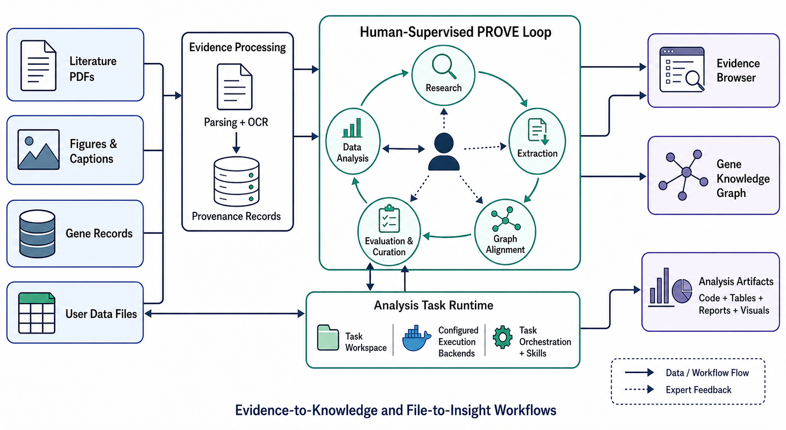

# PROVE-Gene

## An Evidence-Grounded Workbench for Gene Knowledge and Inspectable Data Analysis

  

*Figure 1. Overview of PROVE-Gene: evidence-to-knowledge and file-to-insight workflows.*

PROVE-Gene is an interactive research workbench that connects literature- and figure-derived gene knowledge with user-file analysis. It supports evidence-aware exploration, structured knowledge extraction, and inspectable analytical workflows under a human-supervised research loop.

> **Demo video:** [Watch on YouTube](https://youtu.be/C1qSRFqTiyg)
>
> **Live demo:** [Open PROVE-Gene](https://jackkuo-prove-gene-demo.static.hf.space/index.html)

## What PROVE-Gene demonstrates

- **Gene-centered search and dialogue** — Ask questions in natural language; inspect structured gene summaries, literature-supported answers, and relationship details.
- **Literature review assistance** — Organize retrieved evidence into a traceable review-oriented synthesis.
- **Multimodal knowledge extraction** — Extract gene relations from figures and structured gene fields from full-text PDFs, with links back to supporting paragraphs and figures.
- **Evidence-aware knowledge exploration** — Browse normalized entities and their candidate relations while retaining document- and image-level context.
- **File-to-insight analysis** — Upload research files and obtain an inspectable task plan, generated analysis artifacts, tables, visualizations, reports, and downloadable results. The demonstration includes a GWAS-to-annotation workflow using representative data.

## Evidence and evaluation highlights

- **Image-based gene-name extraction:** On 211 manually annotated plant-gene figures from PubMed literature, the current Gemini 2.5 Pro pipeline obtained macro precision/recall/F1 of 0.9201/0.8997/0.9042 and micro precision/recall/F1 of 0.9261/0.8999/0.9128. Evaluation is string-based after normalization and slash-family alias expansion.
- **Entity normalization:** On 36,696 candidate triples, object-entity matching reached 20,138 / 36,696 (54.88%). Strict-symbol matching, alias matching, and cleaning rules are reported separately to make coverage gains interpretable.
- **Traceable schema:** Schema v11 represents plant, animal, and microbial gene records with shared and type-specific fields. Each extracted field may retain a value, ranked paragraph indices, and optional figure references for field-level review.

These figures describe the current demonstration and coverage evaluations; they are not claims of biological validation or relation-extraction accuracy.

## Data and responsible use

The demonstration uses open-access literature and representative demonstration data. It does not display real user data or personal information. Generated analyses are intended to support expert review and should not be treated as validated biological conclusions without appropriate follow-up.

## Project status

This repository serves as the project page for the PROVE-Gene ICDM 2026 Demo submission. A short walkthrough video and, where appropriate, implementation/deployment resources will be linked here as they are released.

## Citation

Citation details will be added when the corresponding paper is publicly available.
